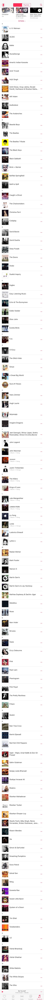
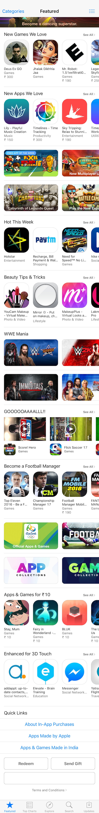
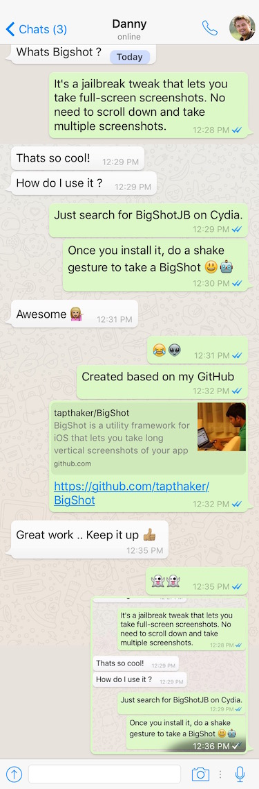

## Bigshot re-written in Objective-C for Jailbreak Tweak.

## Installation ¯\_(ツ)_/¯

Simple: 

Search for the tweak on Bigboss in Cydia and install it. Thats it !!!!

Manual: 

Clone this repository, you need [Theos](http://iphonedevwiki.net/index.php/Theos/Setup) installed for this.
Once you have everything ready install like you would do with any Theos package.

- `make package`
- `make install`

## Usage (.ิ_.ิ)?

Nothing to do here, things will work automatically. Just shake to take a BigShot.

Problems ? (✖╭╮✖)

- Add a new issue on github.
- Add a question on stackoverflow and mention me in a tweet with the link.

## APPLE MUSIC

## APPSTORE

## WHATSAPP

